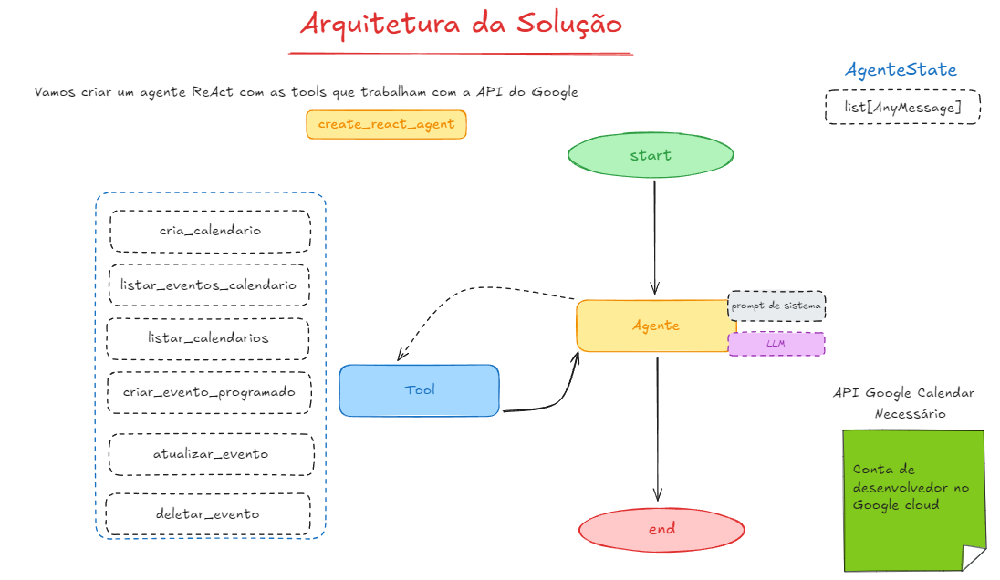

# Agente IA de Gestão do Google Calendar
Este projeto é um agente inteligente que interage com o Google Calendar, permitindo a criação, leitura e manipulação de eventos de forma automatizada.​



# Funcionalidades
- Autenticação com a API do Google Calendar.
- Criação de eventos com detalhes personalizados.
- Leitura e listagem de eventos existentes.
- Atualização e exclusão de eventos.
- Integração com agentes baseados em ReAct para decisões inteligentes.

# Tecnologias Utilizadas
- Python 3.11+
- Google Calendar API ([documentação](https://developers.google.com/workspace/calendar/api/quickstart/python?hl=pt-br))
- Bibliotecas: google-api-python-client, chainlit, langgraph, entre outras.

### Instalação

1. Clone o repositório:

   ```
   git clone https://github.com/GuilhermeKenjiHiroita/Projeto-Agente-IA---Google-Calendar.git
   ```
2. Crie e ative um ambiente virtual:
    ```
    python -m venv venv
    ```
   ```text
   source venv/bin/activate  # No Windows: venv\Scripts\activate
   ```


3. Instale as dependências:

   ```
   pip install -r requirements.txt
   ```

4. Configure as variáveis de ambiente:

   - Renomeie o arquivo `.env.example` para `.env` e atualize as variáveis com seus valores. Exemplo:

   ```
   mv .env.example .env
   ```

6) Execute os exemplos de código via interface ou via terminal, conforme sua preferência.

7) para ativar o chainlit:

   ```
   chainlit run app.py -w
   ```